# Data Lovers
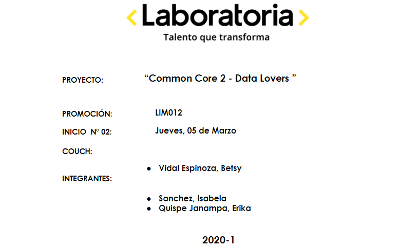

## Índice

* [1. Preámbulo](#1-preámbulo)
* [2. Resumen del proyecto](#2-resumen-del-proyecto)
* [3. Investigación UX](#3-investigación-ux)
* [4. Objetivos de aprendizaje](#4-objetivos-de-aprendizaje)
* [5. Checklist](#5-checklist)

***

## 1. Preámbulo

Antes de empezar, queremos explicar que los juegos de estrategia son videojuegos que requieren que el jugador ponga en práctica sus habilidades de planeamiento y pensamiento para maniobrar. A su vez, mencionar y destacar el uso de páginas web dinámicas que tenemos actualmente, en donde los visitantes pueden interactuar con la información mostrada. Para nuestro proyecto nos hemos enfocado en una página web informativa del juego reconocido mundialmente, League of Legends. Encontrará más información en [Wikipedia](https://es.wikipedia.org/wiki/Videojuego_de_estrategia) y [Cefire](http://cefire.edu.gva.es/file.php/1/Comunicacion_y_apertura/B3_PaginaWeb/pgina_web_esttica_vs_dinmica.html).

## 2. Resumen del proyecto
En este proyecto **construimos una _página web_ para visualizar una
data** del juego online multiplayer, League of Legends. Durante el desarrollo de interacción, el usuario irá aprendiendo de manera sencilla y amena la información de los campeones, de acuerdo a cada búsqueda en particular. El proyecto se ha desarrollado utilizando HTML puro, CSS y Javascript basada en data de formato Json. Como versión final nuestra página web permite **visualizar la data,
filtrarla, ordenarla y hacer algún cálculo agregado**.

Cómo [League of Legends](https://euw.leagueoflegends.com/es-es/) es un juego de estrategia, nuestro proyecto “LOLQuery” sirve como una guía para los jugadores, porque permite visualizar las características esenciales de los campeones. Por lo tanto, la selección de búsqueda según las opciones que brinda LOLQuery, facilitan al usuario ya que pueden prever una estrategia antes de empezar la partida.

* LOL Query:
  Es una app/web para fans del juego League of Legends que desean saber más de los roles
  y estrategias de juego que pueden usar para ser los mejores en la partida.

* Imagen final del proyecto:
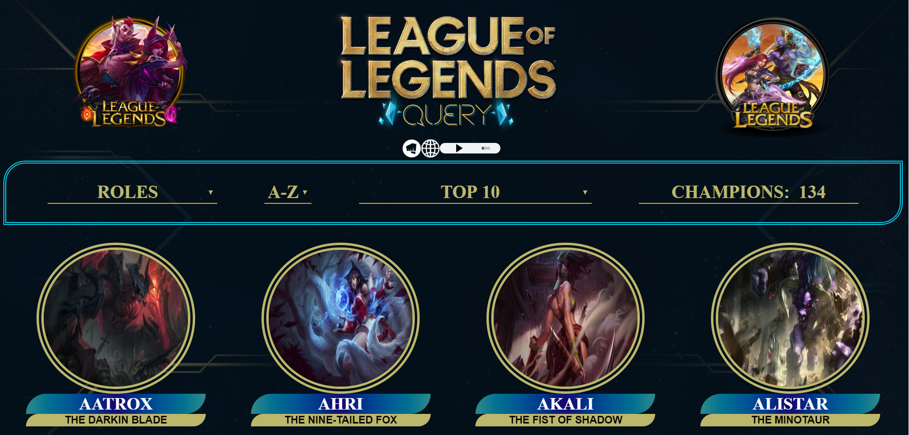
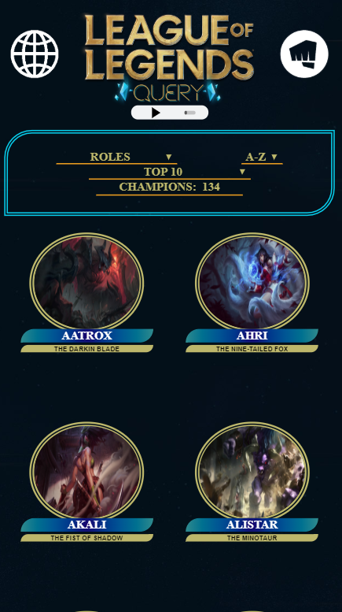

## 3. Investigación UX

  1. USUARIOS:

    * Jugadores de LOL que tienen nivel 10 a más, son nuevos y desean subir de nivel, por lo que
    necesitan elegir a sus campeones por estrategia. De 10 años a 30 apróximadamente.

    * Nos enfocamos en este grupo de usuarios debido a qué son más directos a la hora de
     buscar lo que desean en la web. Acaban de entrar al mundo de LOL y estan fascinados
     por ser los mejores carriando y subir de nivel, es por ellos que existe nuestra web.
     Ellos encontraran en LOL Query, todo los filtros y los Tops necesarios para elegir
     al mejor campeón y asegurar el éxito en cada partida.

  2. HISTORIAS DE USUARIO:
    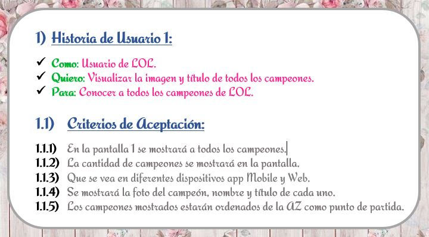
    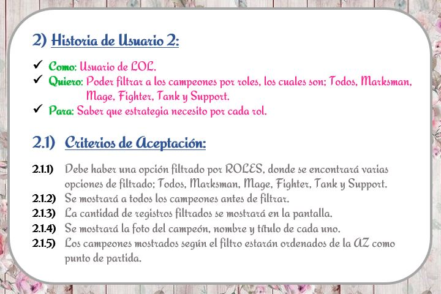
    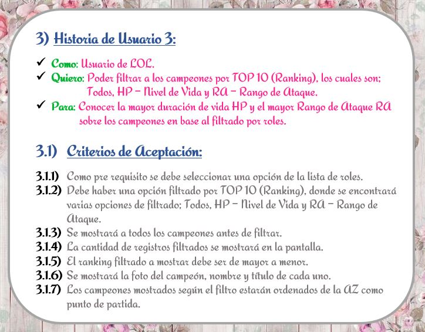
    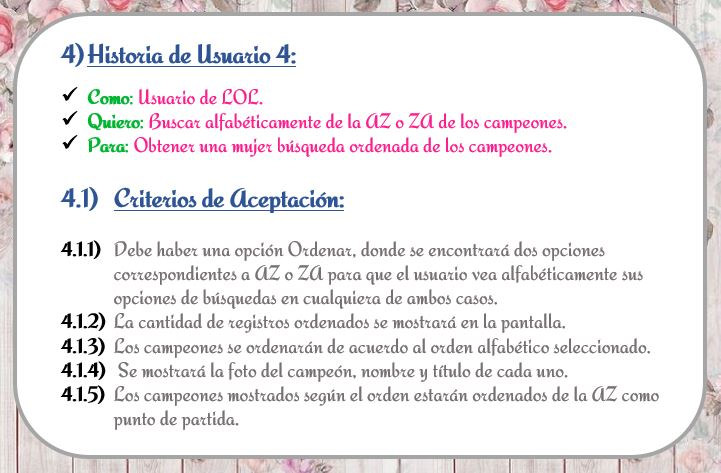

  3. Fotos del prototipo de baja fidelidad:
    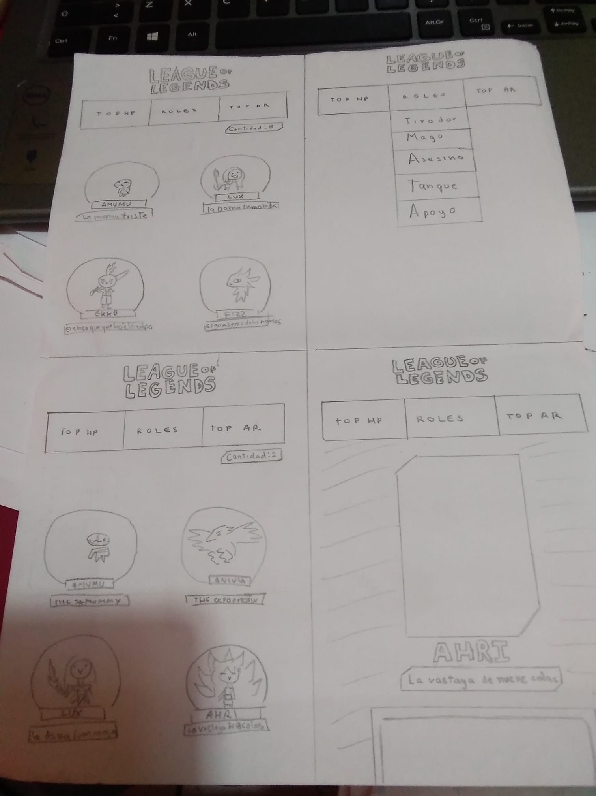
    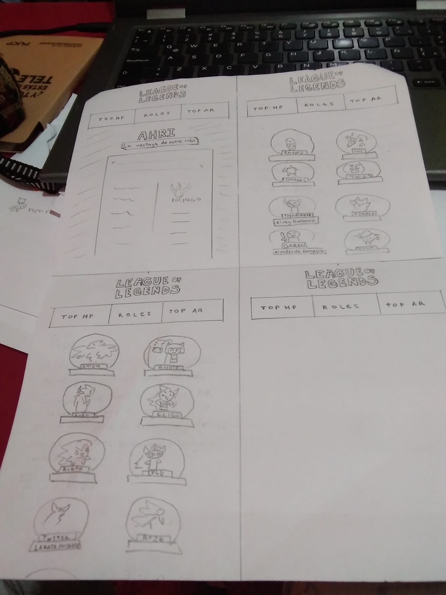

  4. Feedback:
     * Usa una imagen en el fondo
     * Tienes que ordenar la data o darle al usuario opciones para ordenar.
     * Ordena de la A-Z
     * Tu Título llamativo y descriptivos

  5. Testeos de usabilidad:
    * Con el prototipo de baja fidelidad hicimos feedback de usabilidad con compañeras, determinamos dos problemas a resolver, el primero fue la opción campeones para filtrar los roles, era redundante ya que la compañera a la cual hicimos el testeo se quedaba en ese paso sin saber qué más hacer, debido a eso concluimos filtrar por la opción Roles y posteriormente el segundo problema fue la opción de los más fuertes, ya que la búsqueda era ambigua, nuestra compañera no comprendía la relación de los más fuertes con los demás roles, es por ello que determinamos encasillarlo en un filtro llamado TOP10.

  6. Imagen del prototipo final hecho en Figma:

     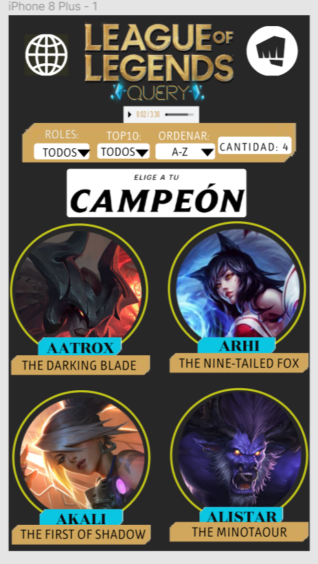
     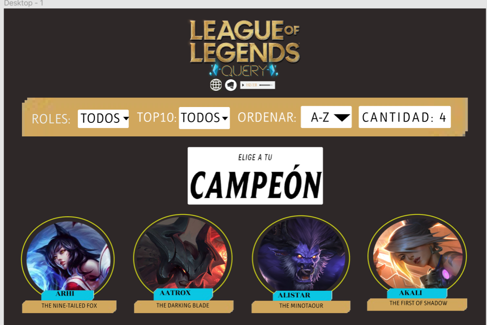
     * Link del figma entero: [Figma LOL query](https://www.figma.com/file/u9RLvGmtt4u1hnD2z0rpgM/LOLquery-Alta-Fidelidad?node-id=0%3A1)

## 4. Objetivos de aprendizaje

El objetivo principal de este proyecto es que, entendiendo las necesidades de
tus usuarios, aprendas a diseñar y construir una interfaz web donde se pueda
visualizar y manipular data.

Revisa la lista y reflexiona sobre los objetivos que conseguiste en el
proyecto anterior. Piensa en eso al decidir tu estrategia de trabajo individual
y de equipo.

### UX

- [✔] Diseñar la aplicación pensando y entendiendo al usuario.
- [✔] Crear prototipos para obtener _feedback_ e iterar.
- [✔] Aplicar los principios de diseño visual (contraste, alineación, jerarquía).
- [✔] Planear y ejecutar _tests_ de usabilidad.

### HTML y CSS

- [✔] Entender y reconocer por qué es importante el HTML semántico.
- [✔] Identificar y entender tipos de selectores en CSS.
- [✔] Entender como funciona `flexbox` en CSS.
- [✔] Construir tu aplicación respetando el diseño planeado (maquetación).

### DOM

- [✔] Entender y reconocer los selectores del DOM (`querySelector` | `querySelectorAll`).
- [✔] Manejar eventos del DOM. (`addEventListener`)
- [✔] Manipular dinámicamente el DOM. (`createElement`, `appendchild`, `innerHTML`, `value`)

### Javascript

- [✔] Manipular arrays (`filter` | `map` | `sort` | `reduce`).
- [✔] Manipular objects (key | value).
- [✔] Entender el uso de condicionales (`if-else` | `switch`).
- [✔] Entender el uso de bucles (`for` | `forEach`).
- [✔] Entender la diferencia entre expression y statements.
- [✔] Utilizar funciones (`parámetros` | `argumentos` | `valor de retorno`).
- [✔] Entender la diferencia entre tipos de datos atómicos y estructurados.
- [✔] Utilizar ES Modules (`import` | `export`).

### Pruebas Unitarias (_testing_)
- [ ] Testear funciones (funciones puras).

### Git y GitHub
- [✔] Ejecutar comandos de git (`add` | `commit` | `pull` | `status` | `push`).
- [✔] Utilizar los repositorios de GitHub (`clone` | `fork` | `gh-pages`).
- [✔] Colaborar en Github (`pull requests`).

### Buenas prácticas de desarrollo
- [✔] Organizar y dividir el código en módulos (Modularización).
- [✔] Utilizar identificadores descriptivos (Nomenclatura | Semántica).
- [ ✔] Utilizar linter para seguir buenas prácticas (ESLINT).

## 5. Checklist

* [✔] Usa VanillaJS.
* [✔] No hace uso de `this`.
* [ ] Pasa linter (`npm run pretest`)
* [✔] Pasa tests (`npm test`)
* [ ] Pruebas unitarias cubren un mínimo del 70% de statements, functions y
  lines y branches.
* [✔] Incluye _Definición del producto_ clara e informativa en `README.md`.
* [✔] Incluye historias de usuario en `README.md`.
* [✔] Incluye _sketch_ de la solución (prototipo de baja fidelidad) en
  `README.md`.
* [✔] Incluye _Diseño de la Interfaz de Usuario_ (prototipo de alta fidelidad)
  en `README.md`.
* [✔] Incluye link a Zeplin en `README.md`.(En nuestro caso Figma)
* [✔] Incluye el listado de problemas que detectaste a través de tests de
  usabilidad en el `README.md`.
* [✔] UI: Muestra lista y/o tabla con datos y/o indicadores.
* [✔] UI: Permite ordenar data por uno o más campos (asc y desc).
* [✔] UI: Permite filtrar data en base a una condición.
* [✔] UI: Es _responsive_.
